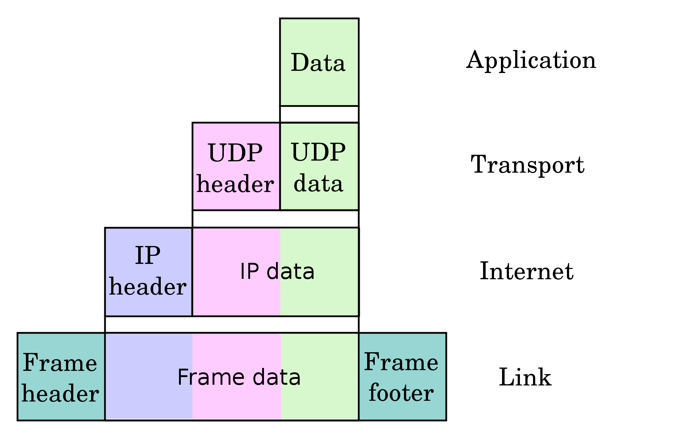
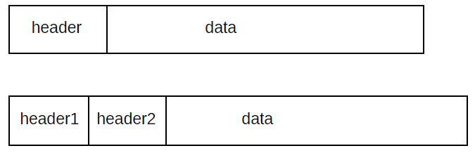

# Table of Contents (up-to-date)
- [Table of Contents (up-to-date)](#table-of-contents-up-to-date)
- [Learning Objective](#learning-objective)
- [An introduction to computer networks](#an-introduction-to-computer-networks)
  - [1. Overview of networks](#1-overview-of-networks)
    - [1.1 Layers](#11-layers)
    - [1.2 Data rate, throughput and bandwidth](#12-data-rate-throughput-and-bandwidth)
    - [1.3 Packets](#13-packets)
    - [1.4 Datagram Forwarding](#14-datagram-forwarding)
    - [1.5 Topology](#15-topology)
    - [1.6 Routing loops](#16-routing-loops)
    - [1.7 Congestion](#17-congestion)
    - [1.8 Package Again](#18-package-again)
    - [1.9 LAN and Ethernet](#19-lan-and-ethernet)
    - [1.10 IP](#110-ip)
      - [1.10.1 IP Forwarding](#1101-ip-forwarding)
    - [1.11 DNS](#111-dns)
    - [1.12 Transport](#112-transport)
- [BACnet: The Global Standard for Building Automation and Control Networks](#bacnet-the-global-standard-for-building-automation-and-control-networks)
  - [Chapter 3: Fundamentals](#chapter-3-fundamentals)

# Learning Objective
1. understand the fundamentals of communication networks
2. understand basic communication services
3. understand BACnet basic communication services
4. understand principles of cyber-attacks on communication networks
5. understand how to detect and defend cyber-attacks on communication networks 

# An introduction to computer networks
The book is open-source by Peter L Dordal.

## 1. Overview of networks

### 1.1 Layers

Network is usually considered as a four-layer model: the Link layer, the Internet-work layer, the Transport Layer and the Application layer. 

The layer corresponds to the idea of a programming interface or library, with the understanding that a given layer communicates directly only with the two layers immediately above and below it. 

    - Link layer: an exampel is LAN, is in charge of actual delivery of packets, using LAN-layer-supplied addresses.
    - Internet-work layer: an example is IP, internet protocol.
    - Transport layer: an example is TCP.
    - Application layer: software application that we use.

The hierarchy is typically `Application - Transport - IP - LAN`.

### 1.2 Data rate, throughput and bandwidth

Any one network connection – e.g. at the LAN layer – has a data rate: 
    
**Data Rate:** the rate at which bits are transmitted. In some LANs (eg Wi-Fi) the data rate can vary with time. 

**Throughput:** refers to the overall effective transmission rate, taking into account things like transmission overhead, protocol inefficiencies and perhaps
even competing traffic. It is generally measured at a higher network layer than the data rate.

**Bandwidth:** can be used to refer to either of these, though we here use it mostly as a synonym for data rate. The term comes from radio transmission, where the width of the frequency band available is proportional, all else being equal, to the data rate that can be achieved.

**Goodput:** is sometimes used to refer to what might also be called “application-layer throughput”: the amount of usable data delivered to the receiving application. Specifically, retransmitted data is counted only once when calculating goodput but might be counted twice under some interpretations of “throughput”.

Data rates are generally measured in kilobits per second (kbps) or megabits per second (Mbps).

### 1.3 Packets

Packets are modest-sized buffers of data, transmitted as a unit through some shared set of links.

Packets are prefixed with a `header` containing deliver information. For example, in `datagram forwarding`, the header containts a destination address. Almost all the networking is packet-based.

At the LAN layer, packets can be viewed as the imposition of a buffer (and addressing) structure on top of low-level serial lines; additional layers then impose additional structure. Informally, packets are often referred to as `frames` at the LAN layer, and as `segments` at the Transport layer.

Generally each layer adds its own header. `Ethernet (LAN layer)` headers are typically 14 bytes, `IP (IP Layer)` headers 20 bytes, and
`TCP (Transport Layer)` headers 20 bytes. If a TCP connection sends 512 bytes of data per packet, then the headers amount to
10% of the total, a not-unreasonable overhead. 
    
> This is calculated as $\frac{14+20+20}{512}$. 

For one common Voice-over-IP option, packets contain 160
bytes of data and 54 bytes of headers, making the header about 25% of the total. Compressing the 160 bytes
of audio, however, may bring the data portion down to 20 bytes, meaning that the headers are now 73% of the total. 

In datagram-forwarding networks the appropriate header will contain the address of the destination and
perhaps other delivery information. Internal nodes of the network called `routers` or `switches` will then try
to ensure that the packet is delivered to the requested destination.

**Octet:** an 8-bit byte

### 1.4 Datagram Forwarding
In the datagram-forwarding model of packet delivery, packet headers contain a destination address.

Switches or routers look at the address in the packet and get to the packet to the correct destination. In datagram forwarding this is achieved by providing each switch with a forwarding table of `<destination,next_hop>` pairs.
> The switch looks up the destination address, and finds the `next_hop` information

>> `next_hop`: the immediate-neighbor address to which the packet should be forward in order to bring it one step closer to its final destination.

> The `next_hop` value in a `forwarding table` is a single entry; each `switch` is responsible for only one step in the packet’s path.

The `destination` entries in the `forwarding table` do not have to correspond exactly with the packet destination addresses, though in the examples here they do, and they do for Ethernet datagram forwarding. However, for IP routing, the table `destination` entries will correspond to prefixes of IP addresses; this leads to a huge savings in space. The fundamental requirement is that the switch can perform a lookup operation, using its forwarding table and the destination address in the arriving packet, to determine the next hop.

By convention, 

- `Switch`: switching devices acting at the LAN layer and forwarding packets based on the LAN address are called switches (or, originally, bridges), 
- `Router`: such devices acting at the IP layer and forwarding on the IP address are called routers.

### 1.5 Topology

In a redundant topology such as cyclic topology where loops exist to provide redundancy of routing path, an issue is how to choose alternative paths.
> `Protocol` provides mechanism so that rounters/swithes can make decision. The mechanism could be as simple as choosing to route via the first path discovered to the given destination.
> `LANs` especially `Ethernet` prefer `tree` networks with no redundancy.
> `IP` has complex protocols in support of redundancy using routing-update algorithm in traffic engineering

### 1.6 Routing loops
A potential drawback to datagram forwarding is the possibility of a routing loop: a set of entries in the forwarding tables that cause some packets to circulate endlessly.

### 1.7 Congestion
Switches introduce the possibility of congestion: packets arriving faster than they can be sent out. 
- This can happen with just two interfaces, if the inbound interface has a higher bandwidth than the outbound interface;
- another common source of congestion is traffic arriving on multiple inputs and all destined for the same output.

Whatever the reason, if packets are arriving for a given outbound interface faster than they can be sent, a queue will form for that interface. Once that queue is full, packets will be `dropped`. The most common strategy (though not the only one) is to drop any packets that arrive when the queue is full.

### 1.8 Package Again
When a router or switch receives a packet, it (generally) reads in the entire packet before looking at the header to decide to what next node to forward it. This is known as `store-and-forward`, and introduces a forwarding delay equal to the time needed to read in the entire packet. For individual packets this forwarding delay is hard to avoid (though some switches do implement cut-through switching to begin forwarding a packet before it has fully arrived), but if one is sending a long train of packets then by keeping multiple packets en route at the same time one can essentially eliminate the significance of the forwarding delay.

Packet delays from sender to receiver is the sum of:

- bandwidth delay: sending 1000 bytes at 20 bytes/ms will take 50 ns. This is a per-link delay
- propagation delay due to the speed of light: long distance transmission
- store-and-forward delay: equal the sum of bandwidth delays out of each router along the path
- queuing delay: waiting time in line at busy routers. `This is the only delay component amendable to reduction throguh careful engineering.`

### 1.9 LAN and Ethernet
 LAN, local area network, is a system consisting of 

- physical links that are, e.g., serial lines
- common interfacing hardware connectting hosts (e.g., local machine) to the links
- protocols to make everything work together

***Ethernet Address***: Each Ethernet card (or network interface) is assigned a (supposedly) unique address at the time of manufacture; this address is burned into the card’s ROM and is called the card’s `physical address` or `hardware address` or `MAC` (Media Access Control) address.

***IP Address***: IP address is assigned administratively by the local site.

The network interface continually monitors all arriving packets; if it sees any packet containing a destination address that matches its own physical address, it grabs the packet and forwards it to the attached CPU (via a CPU interrupt).

***Broadcast***: Ethernet also has a designated broadcast address. A host sending to the broadcast address has its packet received by every other host on the network; if a switch receives a broadcast packet on one port, it forwardsthe packet out every other port. This broadcast mechanism allows host A to contact host B when A does not yet know B’s physical address; typical broadcast queries have forms such as “Will the designated server please answer” or (from the ARP protocol) “will the host with the given IP address please tell me your physical address”.

***Unicast***: Traffic addressed to a particular host, not broadcast, is said to be unicast.

Ethernet is somewhat like attempting to deliver mail using social-security numbers as addresses, where each postal worker is provided with a large catalog listing each person’s SSN together with their physical location. Real postal mail is, of course, addressed “hierarchically” using ever-more-precise specifiers: state, city, zipcode, street address, and name / room#. Ethernet, in other words, does not scale well to “large” sizes.

To forward packets correctly, switches must know where all active destination addresses in the LAN are located. Typically a host physical address is entered into a switch’s forwarding table when a packet from that host is first received; the switch notes the packet’s arrival interface and source address and assumes that the same interface is to be used to deliver packets back to that sender. 

### 1.10 IP
To support universal connectivity, IP provides a global mechanism for `addressing` and `routing`, so that packets can actually be delivered from any host to any other host. IP addresses (for the most-common version 4, which we denote `IPv4`) are 4 bytes (32 bits), and are part of the IP header that generally follows the Ethernet header. The Ethernet header only stays with a packet for one hop; the IP header stays with the packet for its entire journey across the Internet.

***Bit vs Byte***: 

- A bit stores just a 0 or 1
- Group 8 bits together to make 1 byte 
  - 1 bit: 2 patterns - 0, 1
  - 2 bits: 4 patterns - 00, 01, 10, 11
  - 3 bits: 8 patterns - 000, 001, 010, 100, 011, 110, 101, 111
  - 4 bits: 16 patterns
  -  ...
  -  8 bits: 256 patterns - `one byte`

An essential feature of IPv4 (and IPv6) addresses is that they can be divided into a `network` part (a prefix) and a `host` part (the remainder).

The network prefix is commonly denoted by setting the host bits to zero and ending the resultant address with a slash followed by the number of network bits in the address: e.g., `12.0.0.0/8` or `147.126.0.0/16`. 

Each individual LAN technology has a `maximum packet size` it supports; for example, Ethernet has a maximum packet size of about 1500 bytes but the once-competing Token Ring had a maximum of 4 kB.

#### 1.10.1 IP Forwarding

IP routers also use datafram forwarding to deliver packets, but the destination value listed in the forwarding tables are network prefixes - representing entire LAN - instead of individual hosts. The goal of IP forwarding then becomes delivery to the correct LAN. A separate process is used to deliver to the final host once the final LAN has been reached.

The entire point, in fact, of having a network/host division within IP addresses is so that routers need to list only the network prefixes of the destination addresses in their IP forwarding tables. This strategy is the key to IP scalability: it saves large amounts of forwarding-table space, it saves time as smaller tables allow faster lookup, and it saves the bandwidth and overhead that would be needed for routers to keep track of individual addresses.

### 1.11 DNS
IP addresses are hard to remember (nearly impossible in IPv6). The domain name system, or DNS, comes to the rescue by creating a way to convert hierarchical text names to IP addresses. Thus, for example, one can type www.luc.edu instead of 147.126.1.230. Virtually all Internet software uses the same basic library calls to convert DNS names to actual addresses.

### 1.12 Transport
The IP layer gets packets from one node to another, but it is not well-suited to transport. First, IP routing is a “best-effort” mechanism, which means packets can and do get lost sometimes. Additionally, data that does arrive can arrive `out of order`. Finally, IP only supports sending to a specific host; normally, one wants to send to a given application running on that host. Email and web traffic, or two different web sessions, should not be commingled!

The Transport layer is the layer above the IP layer that handles these sorts of issues, often by creating some
sort of connection abstraction. Far and away the most popular mechanism in the Transport layer is the Transmission Control Protocol, or `TCP`. TCP extends IP with the following features:

***Socket Address***

TCP endpoints are of the form `<host, port>`. These pairs are known as socket address.

When you enter a host name in a web browser, it opens a TCP connection to the server’s port 80 (the standard web-traffic port), that is, to the server socket with socket-address `<server,80>`. If you have several browser tabs open, each might connect to the same server socket, but the connections are distinguishable by virtue of using separate ports (and thus having separate socket addresses) on the client end (that is, your end).

TCP uses the `sliding-windows algorithm`, to keep multiple packets en route at any one time. The `window size` represents the number of packets simultaneously in transit (TCP actually keeps track of the window size in bytes, but packets are easier to visualize).

If the window size is 10 packets, for example, then at any one time 10 packets are in transit (perhaps 5 data packets and 5 returning acknowledgments). Assuming no packets are lost, then as each acknowledgment arrives the window “slides forward” by one packet. The data packet 10 packets ahead is then sent, to maintain a total of 10 packets on the wire. For example, consider the moment when the ten packets 20-29 are in transit. When ACK[20] is received, the number of packets outstanding drops to 9 (packets 21-29). To keep 10 packets in flight,
Data[30] is sent. When ACK[21] is received, Data[31] is sent, and so on.

The basic alternative to TCP is known as `UDP`, for `User Datagram Protocol`. UDP, like TCP, provides port numbers to support delivery to multiple endpoints within the receiving host, in effect to a specific process on the host.

# BACnet: The Global Standard for Building Automation and Control Networks

This book is accessible at: https://ebookcentral.proquest.com/lib/tamucs/reader.action?docID=954637&ppg=50 through university netwrok.

## Chapter 3: Fundamentals

Seven-layer basic network model - basic reference model.

Figure [4](#4-brm) is a virtual representation of BRM. The BRM divide up all of the various issues that are involved in enabling machine-to-machine data communication into seven discrete components or "layers". The set of layers is called a `protocol stack`, and the figure represents the protocol stacks implemented on two communicating computers.

